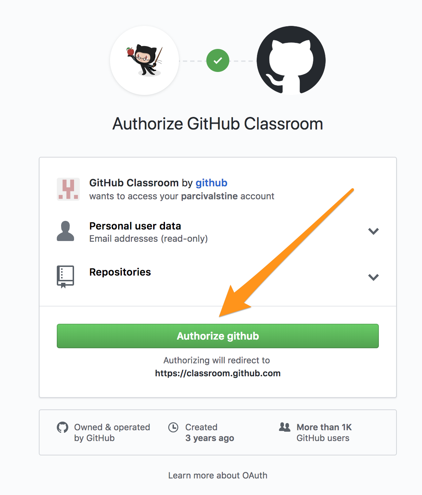
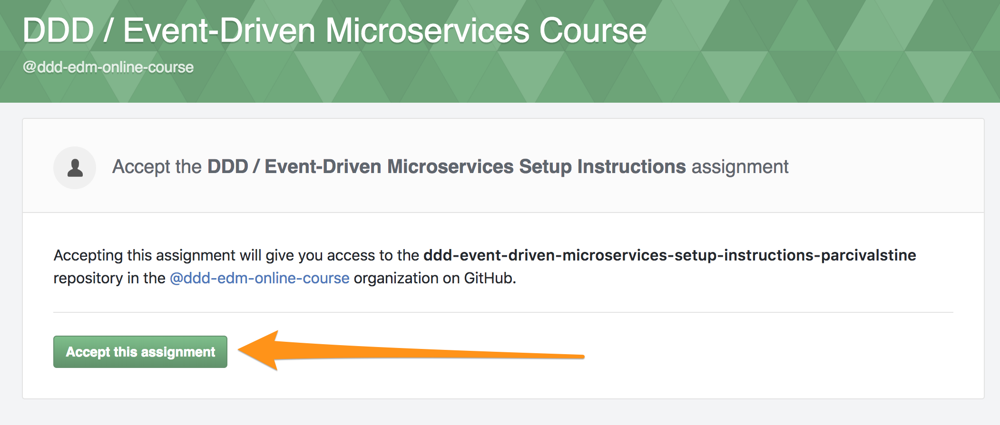
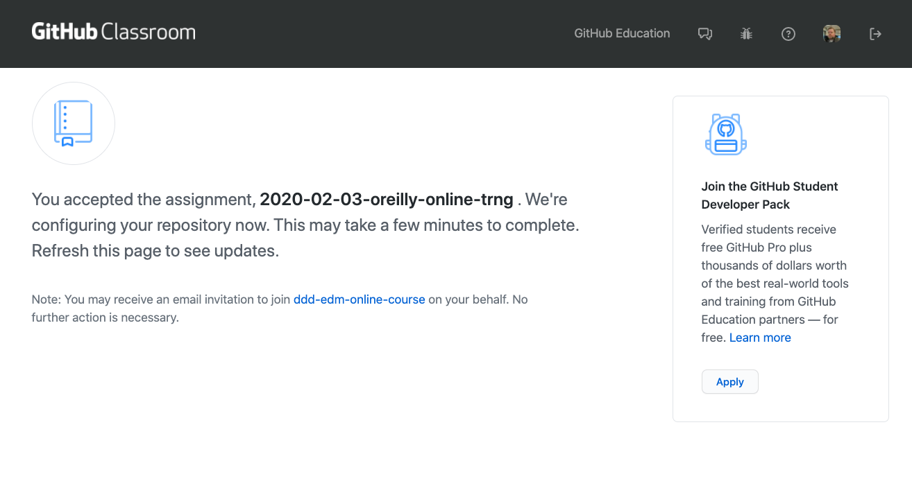
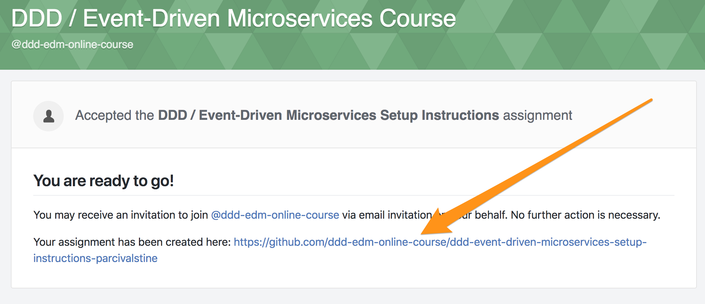
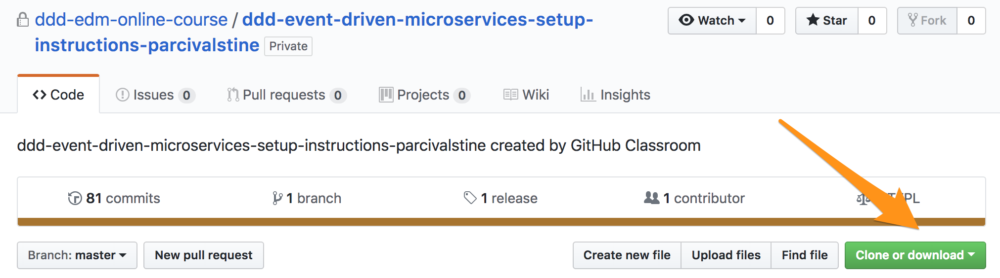

= Materials for Domain-Driven Design and Event-Driven Microservices Online Course

This class will be offered via https://www.safaribooksonline.com/live-training/[O'Reilly's Live Online Training Platform] on a semi-monthly basis. Watch the link for scheduled offerings!

== Syllabus

New architectural paradigms like microservices and evolutionary architecture, as well as the challenges associated with managing data and transactional contexts in distributed systems, have generated a renewed interest in disciplined software design and modular decomposition strategies. We know that the secret to obtaining the benefits of these architectures is getting the boundaries right, both at the team and the component/service level, and then keeping them right as the software continues to evolve! A key reason for getting the boundaries right is that it allows us to create a unified and ubiquitous language within the bounded contexts those boundaries enclose, allowing the business and engineers to have productive and coherent conversations.

Fortunately, there is a mature, battle-tested approach to domain modeling and system decomposition that is a perfect compliment to these architectures: Domain-Driven Design (DDD). In this course, we’ll leverage an exemplar business domain, that of a pizza delivery store, to illustrate DDD-based decomposition strategies, data architecture patterns, and implementations.

=== Prerequisites and Helpful Background:

* Basic familiarity with Domain-Driven Design concepts can ease your understanding of the course material. I recommend reading https://www.safaribooksonline.com/library/view/domain-driven-design-distilled/9780134434964/[_Domain-Driven Design Distilled_] by Vaughn Vernon to get a quick, 101-level overview.
* We will leverage multiple technical architecture concepts in this course. Vaughn Vernon provides a great overview of them in https://www.safaribooksonline.com/library/view/implementing-domain-driven-design/9780133039900/ch04.html[Chapter 4 of _Implementing Domain-Driven Design_].
* Understanding Test-Driven Development is key to programming exercises we’ll complete. https://www.safaribooksonline.com/library/view/growing-object-oriented-software/9780321574442/[_Test-Driven Development: By Example_] is a classic treatment of these concepts. You may also find https://www.safaribooksonline.com/library/view/growing-object-oriented-software/9780321574442/[_Growing Object-Oriented Software, Guided by Tests_] a nice contextual treatment of TDD, mock objects, and object-oriented design.
* We will use the Java programming language, as well as testing libraries such as https://junit.org/[JUnit], https://site.mockito.org/[Mockito], and http://joel-costigliola.github.io/assertj/[AssertJ]. You should be comfortable with Java programming and automated testing libraries.
* Familiarity with Git and GitHub will be required. If you need to brush up your Git(Hub) skills, this https://www.safaribooksonline.com/videos/complete-git-and/9781789137293[Complete Git and GitHub Masterclass] can be helpful.

=== Setup Instructions:

==== Foundational Requirements

*Your computer should be set up with the following capabilities:*

* Java 8
* Maven (recent)
* Git
The IDE/editor you are most comfortable using (make sure you have the Lombok plugin installed! Instructions for https://projectlombok.org/setup/eclipse[Eclipse] and https://projectlombok.org/setup/intellij[IntelliJ] are linked).

*Free SaaS accounts (optional):*

* It will be helpful to have a free https://realtimeboard.com/[RealtimeBoard] account. Alternatively, keep handy a presentation or diagramming tool that you are comfortable using.
* Set up a (free) account with both https://github.com/[GitHub] and https://travis-ci.com/[TravisCI], if possible (see below).

==== (Optional) Setup Path for Enhanced Feedback

The exercises for this course will be enhanced and will provide personalized, real-time feedback if you have (free) accounts with both GitHub and TravisCI. We will use GitHub Classroom to generate a private repository for each participant, and TravisCI will automatically run tests against code exercises submitted to each repository. The instructor will be able to see your code submissions, but no one else.

Accounts with those services are optional, but strongly recommended for the best experience.

. Each class offering has a unique GitHub Classroom invitation link. The link for the May 2019 O'Reilly Online offering is: https://classroom.github.com/a/jd1Nlzwo. Click on it.

. You will be asked to authorize GitHub Classroom to access data from your GitHub account. You will have to accept to continue. If you are not comfortable with this authorization, please continue to the *Setup Path for Basic Participation*.
+

. Next you need to accept the assignment for this course, which will trigger the creation of your private repo.
+

. Creating your repo and copying over the lab environment will take a moment. You'll likely see a progress screen similar to this one:
+

. Once your repository is complete, you can click on the link to visit it:
+

. Copy the clone URL for your repo and clone it to your machine using `git clone <REPO URL>`.
+

At this point, you'll want to pick up with the instructions found in the *README* of your private clone of the lab environment!

==== Setup Path for Basic Participation

Without GitHub and TravisCI accounts, you can still download the course materials manually, as a https://github.com/ddd-edm-online-course/2019-05-14-oreilly-online-trng/archive/master.zip[ZIP file]; you just will not receive personalized feedback on the exercises.

=== Schedule:

==== Day One:

link:slides/00-intro.pdf[**Class Introduction**] (10 minutes)

* Intro to the Course
* Intro to the Instructor
* Class Logistics
* Class Outline

**Lecture:** link:slides/01-why-ddd.pdf[Why do we need DDD?] (15 minutes)

**Lecture:** link:slides/02-ubiquitous-lang.pdf[What is Ubiquitous Language and why is it so important?] (15 minutes)

**Open Q&A and Class Discussion:** Why DDD / Ubiquitous Language (10 minutes)

**Break** (10 minutes)

**Lecture:** link:slides/03-strategic-design.pdf[DDD 101 - Strategic Design: Bounded Contexts, Context Mapping, Subdomains] (25 minutes)

**Open Q&A and Class Discussion:** Strategic Design (10 minutes)

**Lecture:** link:slides/04-tactical-design.pdf[DDD 101 - Tactical Design: Aggregates, Entities, Value Objects, Domain Events, Application Services, Domain Services] (25 minutes)

**Open Q&A and Class Discussion:** Tactical Design (10 minutes)

**Lecture:** link:slides/05-event-storming.pdf[Overview of Event Storming] (15 minutes)

**Break** (10 minutes)

**Lecture:** link:slides/06-the-pizza-shop.pdf[Introduction to the Pizza Shop domain] (10 minutes)

**Open Q&A and Class Discussion:** Event Storming and Pizza Shop Domain (10 minutes)

**Student Activity:** Pizza Shop Event Storming exercise (20 minutes)

**Interactive Screen Share:** Pizza Shop Event Storming solution (15 minutes)

**Lecture:** link:slides/07-event-storm-to-ddd-stories-tdd.pdf[Discuss how Event Storm concepts translate into DDD concepts, User Stories, and TDD code] (20 minutes)

**Open Q&A and Class Discussion:** Day One AMA (10 minutes)

==== Day Two:

**link:slides/07b-day-one-recap.pdf[Day One Recap]** (10 minutes)

**Lecture:** link:slides/08-ddd-tech-arch.pdf[DDD and Technical Architectures] (25 minutes)

**Break** (10 minutes)

**Interactive Screen Share:** Overview of the Pizza Shop Coding Exercise Environment (10 minutes)

**Student Activity:** Lab 1: TDD Aggregate Root - Create Kitchen Commands with Business Logic and Invariants (10 minutes)

**Interactive Screen Share:** Lab 1 Solution (15 minutes)

**Student Activity: Lab 2:** TDD Aggregate Root - Create and Publish Kitchen Domain Events (10 minutes)

**Interactive Screen Share:** Lab 2 Solution (15 minutes)

**Student Activity: Lab 3:** TDD Aggregate Repository - Create Kitchen Repositories and Add Domain Events (10 minutes)

**Interactive Screen Share:** Lab 3 Solution (15 minutes)

**Student Activity: Lab 4:** TDD Aggregate Repository - Rehydrate Kitchen Aggregates by Reference (10 minutes)

**Interactive Screen Share:** Lab 4 Solution (15 minutes)

**Student Activity: Lab 5:** TDD Application Service - Expose Kitchen Business Interface and Implement Transactions (10 minutes)

**Interactive Screen Share:** Lab 5 Solution (15 minutes)

**Student Activity: Lab 6:** TDD Policy - Subscribe to a Kitchen Domain Event from within an Aggregate and Create CQRS View (10 minutes)

**Interactive Screen Share:** Lab 6 Solution (15 minutes)

**Student Activity: Lab 7:** TDD Policy - Subscribe to a Kitchen Domain Event from an Adjacent Aggregate and Update State (10 minutes)

**Interactive Screen Share:** Lab 7 Solution (15 minutes)

**Open Q&A and Class Discussion:** Day Two AMA (10 minutes)
